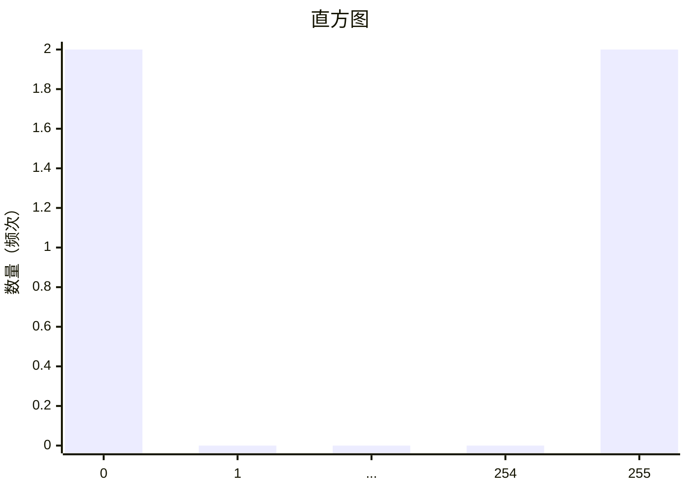

## 原理

### 人为设置阈值法

在这种方法中，我们人为设定一个阈值，比如 取 255 的中间值 127。

在 Python 中，这种除法运算后向下取整的操作可以表示为 255 // 2，也等价于 int(255/2)。

存在的问题：

这种方法的主要问题在于，它并不能适应所有类型的图像。例如，对于一张整体偏暗的照片，大部分像素值可能都会低于 127，因此二值化后的图像几乎全黑。同样，对于一张整体偏亮的照片，大部分像素值可能都会高于 127，因此二值化后的图像几乎全白。

### 优化方法：平均值法

为了解决上述问题，我们可以使用一种被称为"平均值法"的优化方法。在这种方法中，我们不再使用固定的阈值，而是计算图像本身的平均像素值，并用这个值作为阈值。

优点：

这种方法可以更好地适应不同亮度的图像，因为它根据图像的实际像素值分布来确定阈值，而不是简单地使用固定的阈值。对于那些整体偏暗或偏亮的图像，使用平均值法可以得到更好的二值化效果。

注意：

尽管平均值法在许多情况下都能得到不错的结果，但它仍然不能解决所有问题。例如，对于那些既有很亮的区域又有很暗的区域的图像，平均值法可能无法得到理想的二值化效果。在这种情况下，可能需要使用更复杂的方法，如自适应阈值法或 Otsu's 方法等。

### 自适应阈值法

自适应阈值法是一种更为复杂的二值化方法，它不是使用一个全局阈值，而是为图像中的每一个小区域计算一个阈值。这意味着在图像的不同部分可能会使用不同的阈值，使得二值化的效果更好。

自适应阈值法的基本步骤如下：

将图像分割为许多小区域。
对于每一个小区域，计算其像素值的平均值或中值，并将这个值作为该区域的阈值。
对每一个小区域进行二值化。
这种方法对于那些局部亮度变化大的图像特别有效，但是计算量比较大。

### Otsu's 方法

Otsu's 方法是一种自动确定阈值的方法，它通过使得二值化后的图像的类间方差最大化来确定最佳阈值。这种方法的基本步骤如下：

- 对图像的灰度**直方图**进行**归一化**，使其成为一个概率分布。
- 对于每一个可能的阈值，计算**类间方差**。
- 选择使得类间方差最大的阈值作为最佳阈值。

Otsu's 方法对于那些有明显的双峰灰度直方图的图像特别有效，但是对于灰度分布比较均匀的图像可能效果不佳。

#### 归一化

归一化（Normalization）是一种常见的数据预处理技术，用于改变数据的范围以使其落在一个特定的区间，通常是[0,1]或者[-1,1]。归一化的目的是消除数据量纲和尺度的影响，使得不同尺度或单位的数据可以在同一水平上进行比较或处理。

举个例子，假设你有一组数据，范围在 100 到 1000 之间。通过归一化，你可以把这组数据的范围变为 0 到 1。最常见的归一化方法是线性归一化，公式如下：

$$
x' = \frac{x - min(x)}{max(x) - min(x)}
$$

其中$x$是原始数据，$min(x)$和$max(x)$分别是数据的最小值和最大值，$x'$是归一化后的数据。

在很多机器学习和数据分析任务中，归一化是一个常见且重要的步骤，因为很多算法在处理数据时都假设数据已经被归一化，或者至少数据在各个维度上的范围是相似的。

#### 直方图

假设一张 2\*2 大小的灰色图片。

一共四个像素，2 个像素是纯白（0），另外两个像素是纯黑（255）。

它的直方图大致如下（省去中间部分）



#### 方差

差（第一声）的意思是离正常有多远
按照以下的步骤来计算方差：

求数值的 平均
从每一个数值减去平均，然后求差的平方。
把差的平方相加，求结果的平均。（拓展：标准差是方差的平方根）

为什么要求差的平方？

- 如果我们只把和平均的差加起来……负值和正值便会互相抵消
- 用绝对值叫 平均差 ，当数据比较分散，但平均后结果不变，因此它不能反映数据离散程度  
  |4| + |4| + |−4| + |−4| = 16 16/4 = 4  
  |7| + |1| + |−6| + |−2| = 16 16/4 = 4
- 方差（标准差）可以反映数据的离散程度  
  √ [( 72 + 12 + 62 + 22)/4] = 4.74

#### 类间方差

类间方差是指二值化后的两个类（即，阈值以上和以下的像素）的平均值之间的方差。

给定一个灰度图像，其灰度直方图为 $h(r_k)$，$k = 0, 1, 2, ..., L-1$，其中$r_k$是像素值，$L$是灰度级别（对于 8 位图像，$L=256$）。设阈值为$t$，则像素值小于$t$的类记为 C0，像素值大于等于$t$的类记为 C1。

首先，我们需要计算两个类的概率 $p_0(t)$ 和 $p_1(t)$，它们分别表示图像中像素值小于$t$和大于等于$t$的概率：

$$p_0(t) = \sum_{i=0}^{t-1} h(r_i)$$
$$p_1(t) = \sum_{i=t}^{L-1} h(r_i)$$

然后，我们计算两个类的平均灰度 $\mu_0(t)$ 和 $\mu_1(t)$：

$$\mu_0(t) = \sum_{i=0}^{t-1} \frac{i \cdot h(r_i)}{p_0(t)}$$
$$\mu_1(t) = \sum_{i=t}^{L-1} \frac{i \cdot h(r_i)}{p_1(t)}$$

类间方差 $\sigma^2_B(t)$ 定义为：

$$\sigma^2_B(t) = p_0(t) \cdot ( \mu_0(t) - \mu_T )^2 + p_1(t) \cdot ( \mu_1(t) - \mu_T )^2$$

其中，$\mu_T$ 是图像的总平均灰度，计算公式为：

$$\mu_T = \sum_{i=0}^{L-1} i \cdot h(r_i)$$

Otsu's 方法的目标就是找到一个阈值$t$，使得类间方差$\sigma^2_B(t)$最大。这个阈值就是最佳的二值化阈值。这种方法假设图像包含两类像素（即前景和背景），且这两类像素的灰度值分布是双峰的。在这种情况下，类间方差最大的阈值可以很好地分割这两类像素。
(t)最大。这个阈值就是最佳的二值化阈值。这种方法假设图像包含两类像素（即前景和背景），且这两类像素的灰度值分布是双峰的。在这种情况下，类间方差最大的阈值可以很好地分割这两类像素。

缺点：计算量都比较大，特别是对于大图像或高分辨率的图像。因此，在实际使用时需要考虑到计算效率和内存使用的问题。

## 方法

你可能需要安装如下代码库。

```python
pip install numpy pillow matplotlib
```

注意，这些代码示例都假设 `image` 是一个二维的 NumPy 数组，代表一个灰度图像，像素值在 0 到 255 之间。

```python
import numpy as np
from PIL import Image
import matplotlib.pyplot as plt

class ImageThresholding:
    def __init__(self, image_path):
        self.image = np.array(Image.open(image_path).convert('L'))

    def threshold_fixed(self, threshold=127):
        return (self.image > threshold).astype(int)

    def threshold_mean(self):
        threshold = self.image.mean()
        return (self.image > threshold).astype(int)

    def threshold_adaptive(self, window_size=3):
        binary_image = np.zeros_like(self.image)
        h, w = self.image.shape
        for i in range(h):
            for j in range(w):
                i_start = max(0, i - window_size // 2)
                i_end = min(h, i + window_size // 2 + 1)
                j_start = max(0, j - window_size // 2)
                j_end = min(w, j + window_size // 2 + 1)
                window = self.image[i_start:i_end, j_start:j_end]
                threshold = window.mean()
                binary_image[i, j] = self.image[i, j] > threshold
        return binary_image.astype(int)

    def threshold_otsu(self):
        histogram = np.bincount(self.image.ravel(), minlength=256)
        histogram = histogram / np.sum(histogram)
        mu_T = np.sum([i * histogram[i] for i in range(256)])
        best_sigma_B = 0
        best_threshold = 0
        for t in range(256):
            p_0 = np.sum(histogram[:t])
            p_1 = np.sum(histogram[t:])
            mu_0 = np.sum([i * histogram[i] for i in range(t)]) / p_0 if p_0 > 0 else 0
            mu_1 = np.sum([i * histogram[i] for i in range(t, 256)]) / p_1 if p_1 > 0 else 0
            sigma_B = p_0 * (mu_0 - mu_T) ** 2 + p_1 * (mu_1 - mu_T) ** 2
            if sigma_B > best_sigma_B:
                best_sigma_B = sigma_B
                best_threshold = t
        return (self.image > best_threshold).astype(int)

    def show_image(self, image, title):
        plt.imshow(image, cmap='gray')
        plt.title(title)
        plt.axis('off')
        plt.show()

if __name__ == "__main__":
    thresholding = ImageThresholding('img.bmp')
    thresholding.show_image(thresholding.threshold_fixed(), 'Fixed Thresholding')
    thresholding.show_image(thresholding.threshold_mean(), 'Mean Thresholding')
    thresholding.show_image(thresholding.threshold_adaptive(), 'Adaptive Thresholding')
    thresholding.show_image(thresholding.threshold_otsu(), 'Otsu Thresholding')

```

以下原图与四种二值化方案的图像效果：


 |

## 其他

除了上述的方法之外，还有许多其他的二值化方法，每种方法都有其适用的场景和优缺点。

以下是一些常见的二值化方法：

双峰法（Bimodal method）：这种方法假设图像的直方图是双峰的，即有两个主要的亮度级别（通常对应于对象和背景）。阈值被设置为这两个峰值之间的最低点。

最小误差法（Minimum error method）：这种方法假设像素的灰度值来自两个具有相同方差的高斯分布。阈值被设置为最小化两个分布之间的误差的值。

最大熵法（Maximum entropy method）：这种方法选择使得二值化后的两个类（即，阈值以上和以下的像素）的熵之和最大的阈值。

Kittler-Illingworth 最小误差法：这种方法是最小误差法的一个改进版本，它可以处理来自不同高斯分布（即，具有不同方差）的像素。

ISODATA 算法：这是一种迭代的方法，它开始于图像的平均灰度值，然后迭代地计算两个类的平均值，直到阈值稳定。

Niblack 方法：这是一种局部阈值选择方法，它根据每个像素周围的像素的平均值和标准差来计算阈值。

Sauvola 方法：这是 Niblack 方法的一个改进版本，它引入了一个新的参数来处理不同对比度的图像。

多阈值方法：这些方法不是选择一个阈值，而是选择多个阈值，将像素分割成多个类。这对于一些应用可能会很有用，例如在处理具有多个亮度级别的对象的图像时。
