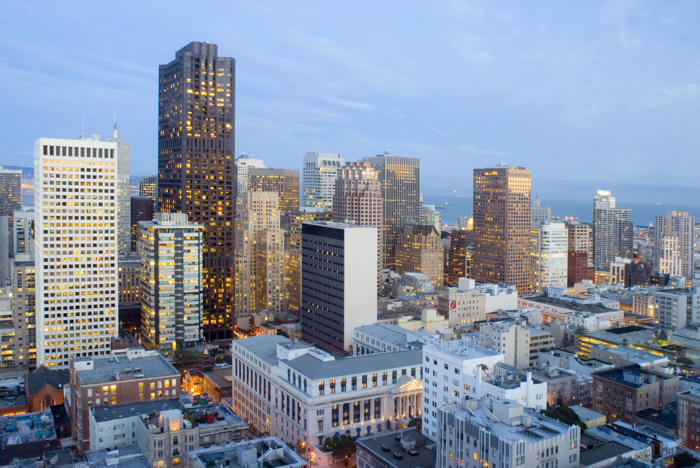
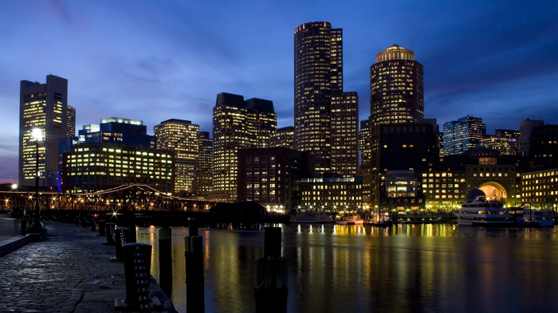
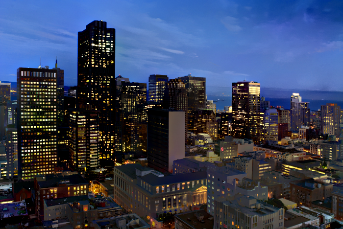
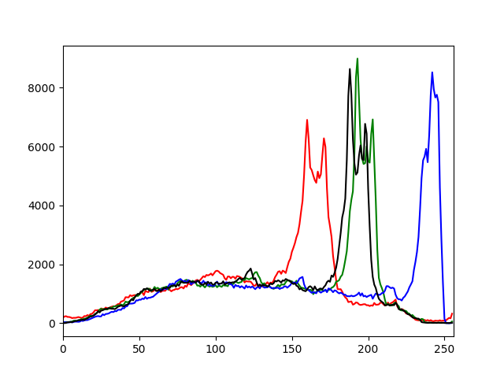
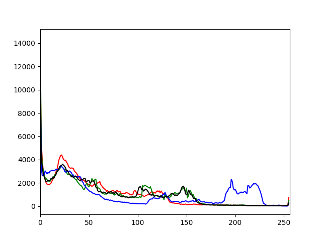
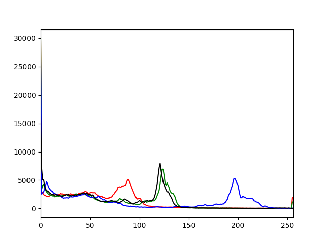
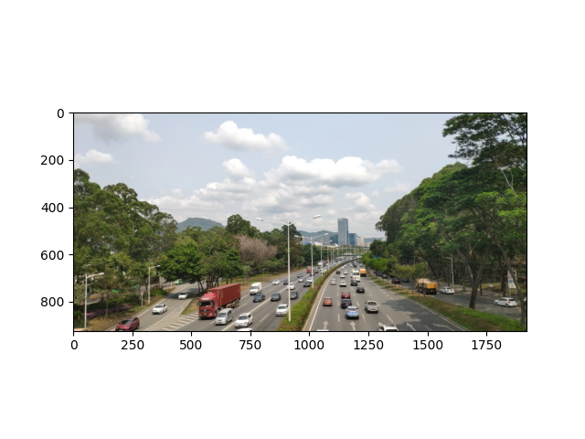
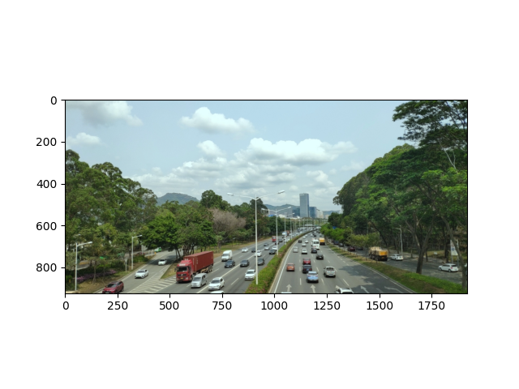

首先思考一个问题，下面的三张照片中，哪两张更加接近？
| 图1 | 图2 | 图3 |
|:---:|:---:|:---:|
|  |  |  |
|  |  |  |

从色彩上来说，中间与右侧的照片更加接近，因为它们的颜色更加相似。

从图形上来说，左侧与右侧的照片更加接近，因为它们的形状更加相似。

那么，如何用计算机来判断两张照片的相似性呢？我们依然可以从形状和颜色两个方面入手。


## 从颜色入手-绘制RGB直方图


### 知识要点

cv2.calcHist()是OpenCV库中的一个函数，用于计算图像的直方图。直方图是一种表示图像像素强度分布的图表，可以帮助我们理解图像的亮度、对比度、强度分布等属性。

函数的参数解释如下：

第一个参数是要计算直方图的图像列表。在这个例子中，我们只计算一个图像的直方图，所以是[image]。

第二个参数是要计算直方图的通道列表。在这个例子中，我们只计算第一个通道（索引为0）的直方图，所以是[0]。对于彩色图像，通常有三个通道（红、绿、蓝），索引分别为0、1、2。

第三个参数是掩码图像，如果提供了，那么只计算掩码图像中的非零部分。在这个例子中，我们不使用掩码图像，所以是None。

第四个参数是表示直方图大小的列表，也就是直方图中有多少个bin。在这个例子中，我们的直方图有256个bin，所以是[256]。

第五个参数是表示像素值范围的列表。在这个例子中，我们的像素值范围是0到256（不包括256），所以是[0, 256]。

### 代码

```python
import cv2
import numpy as np
import matplotlib.pyplot as plt

# 读取图片
image = cv2.imread('你的图片地址')

# OpenCV读取的图片是BGR格式，我们需要将其转换为RGB格式
image = cv2.cvtColor(image, cv2.COLOR_BGR2RGB)

# 绘制R,G,B三个颜色的直方图
colors = ('r', 'g', 'b')
for i, color in enumerate(colors):
    histogram = cv2.calcHist([image], [i], None, [256], [0,256])
    plt.plot(histogram, color=color)
    plt.xlim([0,256])
# 转换为灰度图像并计算灰度直方图
gray_image = cv2.cvtColor(image, cv2.COLOR_RGB2GRAY)
gray_histogram = cv2.calcHist([gray_image], [0], None, [256], [0,256])
plt.plot(gray_histogram, color='k')

# 展示图片
plt.show()
```

### 拓展

通过修改图片的颜色，我们可以给图片添加“滤镜”。下面是常见的摄影色调对应RGB变化的例子：


np.clip是NumPy库中的一个函数，它的作用是将数组中的元素限制在一个范围内。具体来说，对于给定的区间 [a, b]，如果数组中的元素小于 a，那么这个元素就会被设置为 a；如果数组中的元素大于 b，那么这个元素就会被设置为 b。对于在 a 和 b 之间的元素，np.clip 不会改变其值。

```python
import cv2
import numpy as np
import matplotlib.pyplot as plt

# 读取图像
image = cv2.imread('road.webp')

# OpenCV读取的图像是BGR格式的

# 调整蓝色
image[:,:,0] = image[:,:,0]*1
# 调整绿色
image[:,:,1] = image[:,:,1]*1
# 调整红色
image[:,:,2] = image[:,:,2]*0.9

# 确保所有的像素值都在0-255的范围内
image = np.clip(image, 0, 255)

# 将BGR图像转换为RGB图像
image = cv2.cvtColor(image, cv2.COLOR_BGR2RGB)

# 使用matplotlib显示图像
plt.imshow(image)
plt.show()

```

这是我在夏天拍摄的，但调色之后看起来像是冬天拍的

| 图1 | 图2 |
|:---:|:---:|
|  |  |

## 从形状入手

下图是sora技术文章中的截图，他为了把时间添加到训练数据中，把图片切割为了多个部分，每个部分按照时间顺序排列。这样的处理方式，可以让模型更好地学习到时间的信息。


这样的做法可以很好的捕捉每一帧画面不同内容区域的变化。这里我们我们简单的复现单张图片的拆解与重构。


### 拆解

```python

import cv2
import numpy as np
import os

def split_image(image_path, rows, cols):
    # 读取图像
    image = cv2.imread(image_path)

    # 获取图像的尺寸
    height, width, _ = image.shape

    # 计算每个矩形的宽度和高度
    rect_height, rect_width = height // rows, width // cols

    # 创建一个新的文件夹来保存切割后的图像，文件夹的名称为原图像的名称
    dirname = os.path.splitext(image_path)[0]
    if not os.path.exists(dirname):
        os.makedirs(dirname)

    # 遍历每个矩形
    for i in range(rows):
        for j in range(cols):
            # 计算矩形的左上角和右下角的坐标
            start_y, start_x = i * rect_height, j * rect_width
            end_y, end_x = start_y + rect_height, start_x + rect_width

            # 切割图像
            rect = image[start_y:end_y, start_x:end_x]

            # 保存切割后的图像，文件名为原图像的名称前加序号
            filename = os.path.join(dirname, '{}_{}.jpg'.format(i * cols + j, dirname))
            cv2.imwrite(filename, rect)

def join_image(dirname, rows, cols):
    # 初始化一个列表来保存图像
    images = []

    # 读取图像
    for i in range(rows):
        row_images = []
        for j in range(cols):
            filename = os.path.join(dirname, '{}_{}.jpg'.format(i * cols + j, dirname))
            image = cv2.imread(filename)
            row_images.append(image)
        images.append(row_images)

    joined_image = np.concatenate([np.concatenate(row_images, axis=1) for row_images in images], axis=0)
    print(joined_image.shape)

    # 保存拼接后的图像
    cv2.imwrite(dirname + '_joined.jpg', joined_image)
# 分割图像
split_image('1712039631338.png',3, 3)

# 拼接图像
join_image('1712039631338',3, 3)


```