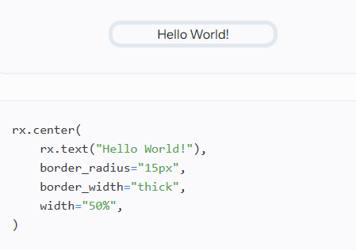
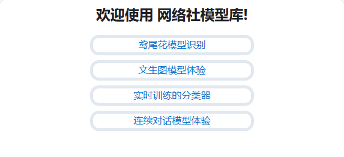
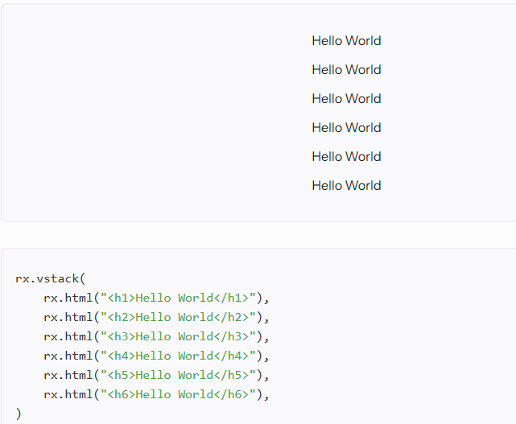
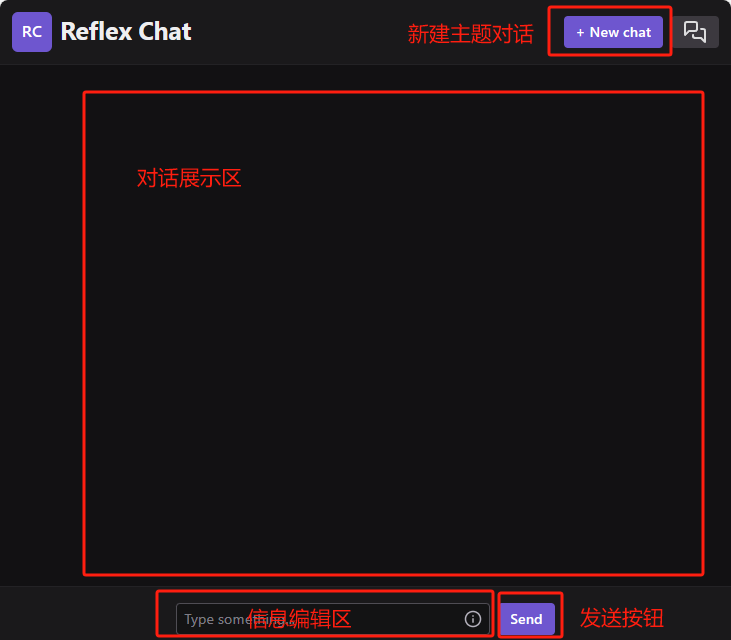

这节课我们继续学习如何使用框架完成网络社模型库网站的开发。

代码的工程能力包括：代码简洁可读、模块拆分清晰合理。主要考察对函数、代码结构的划分、他人代码与文档的阅读理解能力。

## 首页

下面的代码是目标效果，每个超链接都具有相同的样式，简洁美观，请你思考如何用**最少的代码**完成首页的开发。

参考效果



应用效果



<details>

<summary>参考</summary>

```python title="my_app_name\my_app_name\index_page.py"
import reflex as rx


def links(text, href):
    return rx.center(
        rx.link(text, href=href),
        border_radius="15px",
        border_width="thick",
        width="100%",
    )

def index() -> rx.Component:
    return rx.center(
        (
            rx.vstack(
                rx.heading("欢迎使用 网络社模型库!",padding="10px"),
                links("鸢尾花模型识别", href="/knn"),
                links("文生图模型体验", href="/aiimg"),
                links("实时训练的分类器", href="/knntrain"),
                links("连续对话模型体验", href="/chat"),
            ),
        ),
    )

```
</details>

## 调用摄像头的实时训练的分类器

现在我们的目标是，当用户打开网页时，自动调用摄像头，通过用户在网页上的点击实时训练模型并显示效果。

使用Python语言比较复杂，需要使用额外的模块Python-JS模块，转换之后再和当前模块结合，且调用异常没有很多文档可以查询。

而在网页开发的JS语言中，调用摄像头有内置的浏览器接口，目标的效果是这样：[tensorflow.html](https://xde-webclub.github.io/tensorflow.html)

还记得reflex模块的原理吗？把Python代码转化为HTML、CSS、JS。因此它一定可以直接使用原生的HTML、CSS、JS

参考下面的代码，将`tensorflow.html`迁移到模型库中。


<details>

<summary>参考</summary>

```python title="my_app_name\my_app_name\knntrain_page.py"
import reflex as rx


def knntrain():
    return rx.html('''<html><head>
    <!-- Load the latest version of TensorFlow.js -->
    <script src="https://cdn.jsdelivr.net/npm/@tensorflow/tfjs"></script>
    <script src="https://cdn.jsdelivr.net/npm/@tensorflow-models/mobilenet"></script>
    <script src="https://cdn.jsdelivr.net/npm/@tensorflow-models/knn-classifier"></script>
</head>

<body>
    <div style="margin: 0 auto; text-align: center;">
        <div id="console"></div>
        <!-- Add an image that we will use to test -->
        <video style="margin: 0 auto; text-align: center;" autoplay="" playsinline="" muted="" id="webcam" width="224" height="224"></video>
        <br>
        <button id="class-a">Add A</button>
        <button id="class-b">Add B</button>
        <button id="class-c">Add C</button>

        <!-- Load index.js after the content of the page -->
        <p>一个实时的调用摄像头的KNN分类器</p>
        <p>请在联网环境下用先进的浏览器打开</p>
        <p>1.等待模型加载（加载完成后会提示使用摄像头）</p>
        <p>2.点击Add A则获取当前摄像头截图加入A训练集</p>
        <p>3.以此类推</p>
        <p>4.观察屏幕输出的预测结果</p>
        <p>底层由tensorflow编写</p>
    </div>
    <script>
        const classifier = knnClassifier.create();
        const webcamElement = document.getElementById('webcam');

        async function app() {
            console.log('Loading mobilenet..');

            // Load the model.
            net = await mobilenet.load();
            console.log('Successfully loaded model');

            // Create an object from Tensorflow.js data API which could capture image
            // from the web camera as Tensor.
            const webcam = await tf.data.webcam(webcamElement);

            // Reads an image from the webcam and associates it with a specific class
            // index.
            const addExample = async classId => {
                // Capture an image from the web camera.
                const img = await webcam.capture();

                // Get the intermediate activation of MobileNet 'conv_preds' and pass that
                // to the KNN classifier.
                const activation = net.infer(img, true);

                // Pass the intermediate activation to the classifier.
                classifier.addExample(activation, classId);

                // Dispose the tensor to release the memory.
                img.dispose();
            };

            // When clicking a button, add an example for that class.
            document.getElementById('class-a').addEventListener('click', () => addExample(0));
            document.getElementById('class-b').addEventListener('click', () => addExample(1));
            document.getElementById('class-c').addEventListener('click', () => addExample(2));

            while (true) {
                if (classifier.getNumClasses() > 0) {
                    const img = await webcam.capture();

                    // Get the activation from mobilenet from the webcam.
                    const activation = net.infer(img, 'conv_preds');
                    // Get the most likely class and confidence from the classifier module.
                    const result = await classifier.predictClass(activation);

                    const classes = ['A', 'B', 'C'];
                    document.getElementById('console').innerText = `
    prediction: ${classes[result.label]}\n
    probability: ${result.confidences[result.label]}
    `;

                    // Dispose the tensor to release the memory.
                    img.dispose();
                }

                await tf.nextFrame();
            }
        }

        app();
    </script>


</body></html>

''')

```
</details>

## 连续对话的关键

最后我们计划做一个连续对话的语言模型。他的结构如下：



点击发送消息时，未回应完成前。按钮不可再次点击。（简单）

回应的过程中，应该是流式响应的，也就是文本是收到多少，就逐一显示多少，而不是全部收到再全部显示。（响应处理的概念）

每次发送的请求包含之前的对话记录（对象存储的概念）

用户可以新建对话，切换不同的新建对话时对话的历史记录不同。（类与对象的概念，挑战任务）

思考如何完成你的代码最简洁，考察能力：文档的阅读理解速度


参考资料：

文心一言[调用接口文档](https://cloud.baidu.com/doc/WENXINWORKSHOP/s/clntwmv7t)

reflex[调用openai接口代码](https://github.com/reflex-dev/reflex-chat)


你要做的是把调用openai接口代码换成文心一言，但是这并不是简单的复制粘贴，他们之间存在一些不同之处。

参考：https://github.com/XDE-webclub/models
