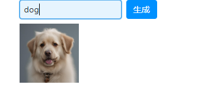
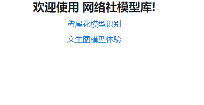

文生图目前已经是比较成熟的一个技术了，不同的方案会提供不同的参数，譬如：画面风格、画面尺寸等等，这里我们以百度提供的文生图的官方API为例，来部署一个文生图模型，为了简化这个过程，我们要求效果如下。



非常简单的一个窗口：一个输入框接收提示词，点击生成按钮，生成一张图片。

这是我们部署的第二个模型，所以我们要重新设计一下：点开主页，是一个提示，可以指向不同模型的部署页面。



## 首页设置

我们需要一个首页，指向不同模型的部署页面,在下面的路径中创建文件。

```python title="my_app_name\my_app_name\index_page.py"
import reflex as rx

def index() -> rx.Component:
    return (
        rx.vstack(
            rx.center(
                rx.heading("欢迎使用 网络社模型库!"),
                width="100%",
            ),
            rx.center(
                rx.vstack(
                    rx.link("鸢尾花模型识别", href="/knn"),
                    rx.link("文生图模型体验", href="/aiimg"),
                ),
                width="100%",
                align="center",
                justify="center",
            ),
        ),
    )

```

## KNN模型部署页面

还是按照之前的方法放置模型路径

```python title="my_app_name\my_app_name\knn_page.py"
import joblib
# 加载模型
knn_from_joblib = joblib.load('knn_model.pkl')
import reflex as rx

class State(rx.State):
    predicted_name: str = ""
    iris_target_names: list = ["setosa", "versicolor", "virginica"]

    def handle_submit(self, form_data: dict):
        """Handle the form submit."""
        # 将字典的值转为浮点数，放置在新的列表中
        iris_example_list = [[float(v) for v in form_data.values()]]
        # 使用模型预测
        predict = knn_from_joblib.predict(iris_example_list)
        # 将预测结果转为花的名称
        self.predicted_name = self.iris_target_names[predict[0]]


def knn() -> rx.Component:
    return rx.center(
        rx.vstack(
            rx.form(
                rx.vstack(
                    rx.hstack(
                        rx.input(
                            placeholder="花萼长度",
                            name="sepal_length",
                        ),
                        rx.input(
                            placeholder="花萼宽度",
                            name="sepal_width",
                        ),
                    ),
                    rx.hstack(
                        rx.input(
                            placeholder="花瓣长度",
                            name="petal_length",
                        ),
                        rx.input(
                            placeholder="花瓣宽度",
                            name="petal_width",
                        ),
                    ),
                    rx.button("判断", type="submit"),
                ),
                on_submit=State.handle_submit,
                reset_on_submit=True,
            ),
            rx.text(State.predicted_name),
        ),
    )
```

## 文生图模型部署页面

```python title="my_app_name\my_app_name\aiimg_page.py"
import reflex as rx
import base64
import io
from PIL import Image
import requests
import json

API_KEY = "**加密**"
SECRET_KEY = "**加密**"


def get_access_token():
    """
    使用 AK，SK 生成鉴权签名（Access Token）
    :return: access_token，或是None(如果错误)
    """
    url = "https://aip.baidubce.com/oauth/2.0/token"
    params = {
        "grant_type": "client_credentials",
        "client_id": API_KEY,
        "client_secret": SECRET_KEY,
    }
    return str(requests.post(url, params=params).json().get("access_token"))


def get_aiimg(prompt=None):

    url = (
        "https://aip.baidubce.com/rpc/2.0/ai_custom/v1/wenxinworkshop/text2image/sd_xl?access_token="
        + get_access_token()
    )

    payload = json.dumps(
        {
            "prompt": str(prompt),
            "size": "768x768",
            "n": 1,
            "steps": 20,
            "sampler_index": "Euler a",
        }
    )
    headers = {"Content-Type": "application/json", "Accept": "application/json"}

    response = requests.request("POST", url, headers=headers, data=payload)

    data = response.text

    base64_str = json.loads(data)["data"][0]["b64_image"]

    image_data = base64.b64decode(base64_str)

    image_data = io.BytesIO(image_data)

    return Image.open(image_data)

class ImgState(rx.State):
    image: Image.Image = None

    def prompt_submit(self, form_data: dict):
        self.image = get_aiimg(form_data["prompt"])

def aiimg() -> rx.Component:
    return rx.center(
        rx.vstack(
            rx.form(
                rx.hstack(
                    rx.input(
                        placeholder="提示词",
                        name="prompt",
                    ),
                    rx.button("生成", type="submit"),
                ),
                on_submit=ImgState.prompt_submit,
                reset_on_submit=False,
            ),
            rx.image(src=ImgState.image, width="100px", height="auto")
        ),
    )

```

## 主程序

```python title="my_app_name\my_app_name\my_app_name.py"
from rxconfig import config
import reflex as rx
from my_app_name.index_page import index
from my_app_name.knn_page import knn
from my_app_name.aiimg_page import aiimg

app = rx.App()
app.add_page(index, route="/")
app.add_page(knn, route="/knn")
app.add_page(aiimg, route="/aiimg")
```


## 考核

基于上面的代码，请你完成以下改进：

1. 新增一个输入框，用于接收文生图的补充参数，全部学生需完成。

```bash
size	string	否	生成图片长宽，默认值 1024x1024，取值范围如下：
· 适用头像： ["768x768", "1024x1024", "1536x1536", "2048x2048"]
· 适用文章配图 ：["1024x768", "2048x1536"]
· 适用海报传单：["768x1024", "1536x2048"]
· 适用电脑壁纸：["1024x576", "2048x1152"]
· 适用海报传单：["576x1024", "1152x2048"]


style	string	否	生成风格。

说明：
（1）可选值：
· Base：基础风格
· 3D Model：3D模型
· Analog Film：模拟胶片
· Anime：动漫
· Cinematic：电影
· Comic Book：漫画
· Craft Clay：工艺黏土
· Digital Art：数字艺术
· Enhance：增强
· Fantasy Art：幻想艺术
· Isometric：等距风格
· Line Art：线条艺术
· Lowpoly：低多边形
· Neonpunk：霓虹朋克
· Origami：折纸
· Photographic：摄影
· Pixel Art：像素艺术
· Texture：纹理
（2）默认值为Base
```

2. 为了避免在生成图片的过程中，用户等待时间过长，在生成图片的过程中，显示一个加载中的动画并锁定按钮，避免重复发出请求。部分学生需完成，将整个项目打包成一个zip文件，提交到课程系统中。


下节课增加第三个模型的部署页面：连续对话的语言模型。
