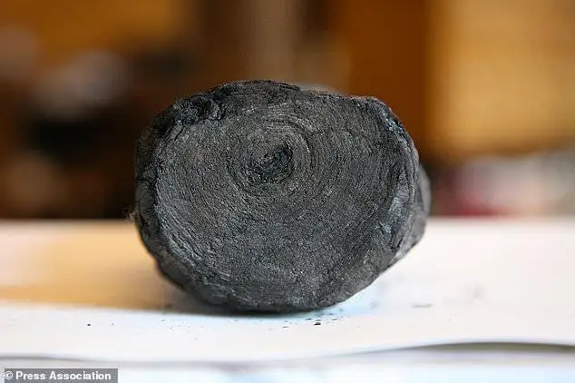

在上一讲中，我们探讨了自定义二值化的各种策略，这些策略有助于我们在默认二值化效果不理想的情况下找到解决方案。

今天，我们将以此为基础，挑战一个真实且持续进行的技术难题：《火山下的文明——维苏威古卷》

我希望通过这个项目，让大家了解到机器学习的完整流程，并对其中的关键概念给出代码并做出解释。

## 项目概述

公元79年10月24日，意大利的维苏威火山爆发，一天之内就毁灭了两万多人的庞贝古城。

火山灰掩盖了整座城市，其中有一栋房子存放了各种书籍。直到18世纪，这栋房子才重新被发现，下面是考古学家的建筑复原图。

房子里面的1800多卷纸莎草古书，都已经完全碳化。

考古学家试图展开这些烧焦的古书，但是纸张一碰就碎。

每一页的碎片就像下面这样。

没有人能从这些烧焦的古书上，读出一个字。

2019年，一位美国科学家提出了一种新方法，使用短红外高光谱成像技术，对这些古卷进行 3D 扫描，然后虚拟建模，在不接触古卷的情况下，就可以展开或压平每一页，从而复现上面的笔迹。

下面是扫描后的页面结果。

问题是上面的笔迹还是很模糊，无法确定是哪一个字母，更不要说读出句子了。

2023年3月，在一些风险投资者的资助下，古卷保管单位举办了一次比赛，邀请全世界的程序员参加，要求使用机器学习，认出上面是什么字母，破解古卷的内容，奖金总额高达100万美元。

:::tip
该项目首要赞助商为马斯克基金会。

发掘地的图书馆已被证实属于当时罗马最有权势的人之一：凯撒的岳父。

红外成像部分使用的是蔡司的镜头（光刻机用的也是蔡司的镜头）
:::

主办单位原以为，一年之内成功的可能性不到30%。但是，2023年10月，21岁的内布拉斯加大学的学生卢克·法里托（Luke Farritor）就读出了第一个单词 ΠΟΡΦΥΡΑϹ（紫色）。

后来，他与正在柏林读博士的纳德（Youssef Nader）、瑞士苏黎世理工学院的机器人专业的学生席里格（Julian Schilliger），组成了一个团队，致力于建立一个完整的 AI 模型识别这些古书。

他们最终在比赛的截止日期前（2024年1月1日）识别出了2000个字符。

下面就是采用他们的模型，结合红外成像识别出来的碎片，内容已经清晰还原出来了。

2月5日，主办单位宣布，他们获得了本次比赛的第一名。

由于比赛结果令人鼓舞，主办单位扩展了自己的目标，接下来将对90%的维苏威古卷，进行扫描和识别，彻底破解两千年前的罗马人在书里写了什么。

他们所用的模型，已经全部开源，就放在 GitHub。任何人都可以安装和运行，尝试改进他们的模型，获得更好的结果。

现代科技的发展，真像神话一样，烧成灰的纸都能辨认出文字。

项目官网： https://scrollprize.org/

该项目在B站有纪录片。

## 项目分析

在2024年，文本识别已经是一项非常成熟的技术。然而，每个项目都有其独特性，阅读碳化卷轴的过程分为三个步骤：

### 扫描

使用 X 射线断层扫描创建卷轴或片段的 3D 扫描

3D扫描的原理是：墨水区域与纸张区域对粒子的穿透率不同，因此在 X 射线扫描中墨水会呈现白色，纸张会呈现黑色。

:::tip
这个步骤通常由专业的机构完成，我们只需要获取扫描结果即可。
不同的粒子可以获得不同的建模，但是目前来说这一步并不会影响结果。
:::

### 分割和展平

在 3D 扫描中找到卷起的纸莎草纸的各层，然后将它们展开成展平的“表面体积”

卷轴。
从技术上讲，我们可以为整个卷轴制作一个巨大的“片段”，但实际上卷轴包装可能很难区分，因此我们将其分成更易于管理的部分。

分割可能具有挑战性，因为纸莎草的不同层可能会被损坏、扭曲或磨损。碳化的纸莎草会起泡，不同的层甚至可以相互融合。

在碎片上，这个过程要容易一些，因为它们已经相当平坦，并且有一个暴露的表面，我们实际上可以在上面看到墨水。尽管如此，这些碎片通常并不完全平坦，并且可能在可见层下方附着有纸莎草的“隐藏层”。

:::tip
新手可以从碎片入手，因为它们更容易处理。
:::

### 墨水检测

使用机器学习模型识别展平表面体积中的墨水区域

演示视频：https://scrollprize.org/img/tutorials/ink-detection-anim2-dark.webm

数据集：https://www.kaggle.com/competitions/vesuvius-challenge-ink-detection/data

## 任务聚焦：墨水检测

到这里，我们需要暂停一下。思考下怎么编写代码。或者说，代码应该包含哪些部分？

