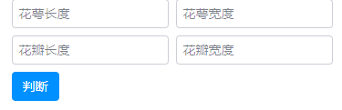
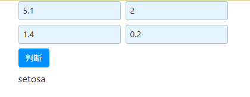
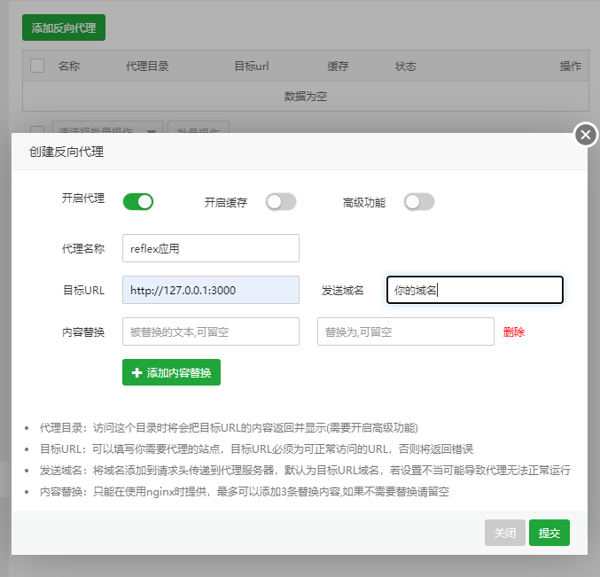

在此之前，我们的程序一直是在本地运行的，现在我们将把我们的程序部署为应用，方便其他学术工作者使用。

为了方便你理解这个过程，我选择了你最熟悉的鸢尾花识别程序，构建好的效果如下

用户输入数据：



点击判断即可获得花形：



开始之前先安装一个模块：
```
pip install reflex==0.4.9 -i https://pypi.tuna.tsinghua.edu.cn/simple
```

下面我们思考下项目逻辑：哪些步骤是点击之前应该完成的，哪些步骤是点击时完成的，哪些步骤是点击之后完成的。

考察能力：

- 路径的理解能力
- 工作区的概念
- 代码的工程能力
- 类与对象的基本概念

## 保存你的模型

### 保存数据的方法

我们可以使用 pickle 或 joblib 库。这两个库都可以将 Python 对象序列化为一个文件，然后再从文件中反序列化回 Python 对象。

使用 pickle 库保存模型的代码如下：
```python
import pickle

knn = '你的文件'

# 保存模型
with open('knn_model.pkl', 'wb') as f:
    pickle.dump(knn, f)

# 加载模型
with open('knn_model.pkl', 'rb') as f:
    knn_from_pickle = pickle.load(f)
```

使用 joblib 库保存模型的代码如下：
```python
import joblib

knn = '你的文件'

# 保存模型
joblib.dump(knn, 'knn_model.pkl')

# 加载模型
knn_from_joblib = joblib.load('knn_model.pkl')
```
### 保存鸢尾花分类器

这里我们以一个鸢尾花分类器为例，请确保自己可以独立完成这个步骤以保存模型。

```python
from sklearn.neighbors import KNeighborsClassifier
import joblib

# 导入鸢尾花数据库
from sklearn.datasets import load_iris

# 加载数据集，数据集包含数据的特征、标签、类别等许多信息
iris = load_iris()
# 获取数据特征（即花的高度、宽度等）
iris_X = iris.data
# 获取数据标签（即花的品种，用0、1、2代替）
iris_y = iris.target
# 实例化KNN分类器
knn = KNeighborsClassifier()
# .fit()方法用于训练模型，即让模型从数据中学习
knn.fit(iris_X, iris_y)
# 保存模型
joblib.dump(knn, 'knn_model.pkl')
```

## 纯Python构建网页应用

### 初始化reflex项目
```
安装模块：
pip install reflex==0.4.9

使用镜像源安装模块：
pip install reflex==0.4.9 -i https://pypi.tuna.tsinghua.edu.cn/simple

创建一个名为my_app_name的文件夹:
mkdir my_app_name

进入my_app_name文件夹
cd my_app_name

初始化一个reflex项目
reflex init
```

此时，屏幕会弹出一段询问，如下：

```shell
Get started with a template:
(0) blank (https://blank-template.reflex.run) - A minimal template
(1) dashboard (https://dashboard.reflex.run) - A dashboard with tables and graphs
(2) chat (https://chat.reflex.run) - A ChatGPT clone
(3) sidebar (https://sidebar-template.reflex.run) - A template with a sidebar to navigate pages
```
对应的含义是：

```shell
从模板开始：
(0) 空白 (https://blank-template.reflex.run) - 最小模板
(1) dashboard (https://dashboard.reflex.run) - 带有表格和图表的仪表盘
(2) 聊天 (https://chat.reflex.run) - ChatGPT 克隆版
(3) 侧边栏 (https://sidebar-template.reflex.run) - 带侧边栏的模板，用于浏览页面
```

这里我们选择选择0，最小化模板

接着使用 `reflex run` 启动这个项目，然后在浏览器中打开 http://localhost:3000

如果你的3000端口被占用，会自动使用3001端口中打开，以此类推。

## 将模型与网页应用结合

### 将模型放置到网页应用中

首先我们将模型文件移动在项目文件夹中，然后可以使用如下代码调用。

```python title="my_app_name\knn_model.py"
import joblib
# 加载模型
knn_from_joblib = joblib.load('knn_model.pkl')

# 对应的knn_model.pkl文件也应该在my_app_name文件夹中
# 路径为：my_app_name\knn_model.pkl
```

### 编写基本的代码逻辑

项目化的代码往往被拆分为多个文件夹与文件，这里我们找到生成页面的代码，将其替换为我们的代码。

下面`####################`的部分是你需要填写的代码。

```python title="my_app_name\my_app_name\my_app_name.py"
from rxconfig import config
import reflex as rx
# 导入加载的模型
####################

class State(rx.State):
    predicted_name: str = ""
    iris_target_names: list = ["setosa", "versicolor", "virginica"]

    def handle_submit(self, form_data: dict):
        """Handle the form submit."""
        # 将字典的值转为浮点数，放置在新的列表中
        ####################
        # 使用模型预测
        ####################
        # 将预测结果转为花的名称
        ####################
  
def index() -> rx.Component:
    return rx.center(
        rx.vstack(
            rx.form(
                rx.vstack(
                    rx.hstack(
                        rx.input(
                            placeholder="花萼长度",
                            name="sepal_length",
                        ),
                        rx.input(
                            placeholder="花萼宽度",
                            name="sepal_width",
                        ),
                    ),
                    rx.hstack(
                        rx.input(
                            placeholder="花瓣长度",
                            name="petal_length",
                        ),
                        rx.input(
                            placeholder="花瓣宽度",
                            name="petal_width",
                        ),
                    ),
                    rx.button("判断", type="submit"),
                ),
                on_submit=State.handle_submit,
                reset_on_submit=True,
            ),
            rx.text(State.predicted_name),
        ),
    )

# 创建一个app
app = rx.App()
# 添加页面
app.add_page(index)
```


<details>

```python title="my_app_name\my_app_name\my_app_name.py"
from rxconfig import config
import reflex as rx
from knn_model import knn_from_joblib

class State(rx.State):
    predicted_name: str = ""
    iris_target_names: list = ["setosa", "versicolor", "virginica"]

    def handle_submit(self, form_data: dict):
        """Handle the form submit."""
        # 将字典的值转为浮点数，放置在新的列表中
        iris_example_list = [[float(v) for v in form_data.values()]]
        # 使用模型预测
        predict = knn_from_joblib.predict(iris_example_list)
        # 将预测结果转为花的名称
        self.predicted_name = self.iris_target_names[predict[0]]


def index() -> rx.Component:
    return rx.center(
        rx.vstack(
            rx.form(
                rx.vstack(
                    rx.hstack(
                        rx.input(
                            placeholder="花萼长度",
                            name="sepal_length",
                        ),
                        rx.input(
                            placeholder="花萼宽度",
                            name="sepal_width",
                        ),
                    ),
                    rx.hstack(
                        rx.input(
                            placeholder="花瓣长度",
                            name="petal_length",
                        ),
                        rx.input(
                            placeholder="花瓣宽度",
                            name="petal_width",
                        ),
                    ),
                    rx.button("判断", type="submit"),
                ),
                on_submit=State.handle_submit,
                reset_on_submit=True,
            ),
            rx.text(State.predicted_name),
        ),
    )

# 创建一个app
app = rx.App()
# 添加页面
app.add_page(index)
```
</details>

恭喜你，你已经完成了模型的部署，如果你购买了云服务器+域名，你可以将这个项目部署到云服务器上，把你的端口和域名通过反向代理关联起来，然后就通过域名访问到你的端口了。



这节课我们只讲了最基本的接收文字，如果你构建的是一个图像识别模型或者视频识别模型，你还需要考虑如何接收图片/视频。

下节课的可选方向：

- 大语言模型的部署（如何记录保存对话记录）
- 文生图模型API的部署（如何调用图像显示）